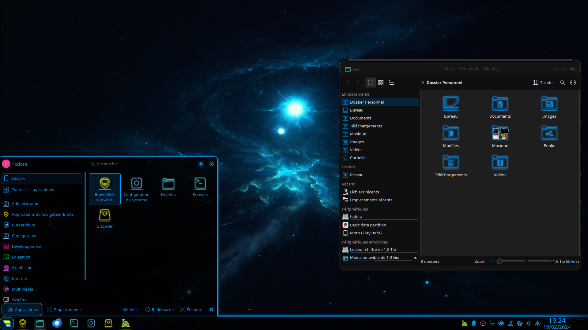

Hace aproximadamente un mes, volví a personalizar el entorno de escritorio de KDE. Mientras yo buscaba formas de personalizar el entorno de escritorio, recordé que encontré un tema de aspecto de ciencia ficticia que encajaría maravillosamente con mi configuración de KDE en 2021. Establecí este tema brevemente en ese momento, pero ahora lo usaré por mucho más tiempo en mis configuraciones más nuevas.

Aquí les cuento una pequeña historia: estaba ejecutando Arch Linux en un escritorio antiguo que utilizaba un procesador Athlon 64 4200+, 2 GB de RAM y Windows XP preinstalado. Tuve que hacer cambios en los componentes internos de la computadora reemplazando la GPU, ya que no tenía HDMI y solo tenía 256 MB de VRAM. Si recuerdo correctamente, la nueva GPU de esta computadora tiene 4 GB de VRAM. No he cambiado otros componentes de la computadora, pero cambié el sistema operativo Windows XP por Arch Linux porque Microsoft dejó de ofrecer soporte para Windows XP desde fines de 2014.

Cuando terminé de instalar Arch Linux, LXDE se estaba ejecutando en esa computadora, luego pasé a entornos de escritorio que demandan más memoria, como XFCE, el liviano, hasta llegar a GNOME, que consume mucha memoria. GNOME a veces se congela en este escritorio como yo esperaba, pero no se bloqueaba todo el tiempo. Experimenté con diferentes administradores de mosaicos que apenas ocupan RAM.

Cuando estaba usando KDE en una computadora Athlon 64, experimenté con otros temas de KDE para encontrar el tema que más me convenía. Salté entre KDE y otros entornos de escritorio y viceversa. No pude encontrar un tema de KDE que se adaptara perfectamente a mí.

Avanzando rápidamente hasta 2023, instalé Fedora Linux GNOME en mi disco externo conectado al puerto USB de mi computadora portátil. Usé GNOME durante un tiempo. Luego, cambié a KDE y me di cuenta de que KDE se veía mejor en la computadora portátil. En la otra computadora, instalé Arch Linux en el disco duro interno secundario de mi escritorio. Lo instalé manualmente e instalé KDE en esa máquina. Intenté instalar NixOS y Gentoo, pero ambos fallaron en mi escritorio.

Luego, inicié Fedora para lanzar el programa de configuración del sistema en KDE. Fui a apariencias con los pasos para navegar hasta el administrador de descarga de temas de KDE. Luego busqué Lyra Blue de memoria y luego configuré los temas de Lyra Blue como temas predeterminados para KDE y el administrador de pantalla SDDM. Hice lo mismo con el escritorio, pero con un fondo de pantalla diferente.

El tema Lyra Blue de KDE parecía muy de ciencia ficticia. Me recordó cuando usé KDE Plasma con el mismo tema hace 3 años.

En conclusión, estoy satisfecho con las configuraciones que hice para mis computadoras que funcionan con Linux. Me recuerda a estar en un pasillo de ciencia ficticia.
