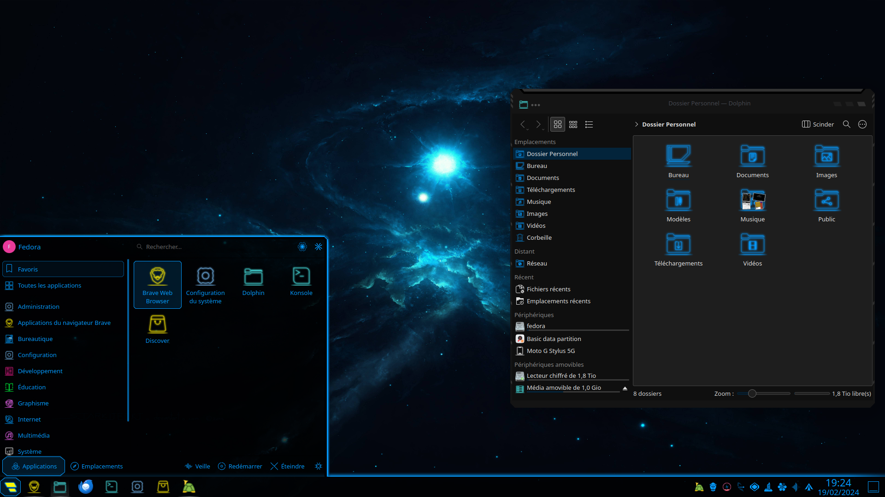

Around a month ago, I recustomized the KDE desktop environment. While finding ways to customize the desktop environment, I remembered that I found a sci-fi-looking theme that would fit nicely with my KDE setup back in 2021. I briefly set this theme in that time, but now I will be using it much longer on my newer setups.

Here's a little story, I was running Arch Linux on an old desktop that utilized an Athlon 64 4200+ processor, 2GB of RAM, and Windows XP preinstalled. I had to make changes to the computer internals by replacing the GPU since it didn't have HDMI and it only had 256MB VRAM. If I remember correctly, the new GPU in this computer has 4GB VRAM. I have not swapped other computer components, but I changed the Windows XP operating system to Arch Linux because Microsoft has stopped supporting Windows XP since late 2014.

When I finished installing Arch Linux, LXDE was running on that computer, I then advanced to more memory-demanding desktop environments like lightweight XFCE, all the way to memory-hungry GNOME. GNOME sometimes freezes on this desktop as expected, but it didn't crash all the time. I experimented with different tiling managers which barely take up any RAM.

When I was using KDE on an Athlon 64 computer, I experimented with other KDE themes to find what theme suited me the most. I hopped between KDE and other desktop environments and vice versa. I could not find a KDE theme that would perfectly suit me.

Fast forward to 2023, I installed Fedora Linux GNOME on my external drive attaching to my laptop USB port. I used GNOME for some time, then I switched to KDE realizing that KDE looked nicer on the laptop. On the other computer, I installed Arch Linux on my secondary internal hard drive of my desktop. I installed it manually, and I installed KDE on that machine. I did attempt to install NixOS and Gentoo, but they both failed on my desktop.

Then, I booted up Fedora to launch system configuration program on KDE. I went to appearances with steps to navigate me to the KDE theme download manager. Then I searched up Lyra Blue from memory and then I set the Lyra Blue themes as default themes for KDE and SDDM display manager. I did the same with the desktop but with a different wallpaper.

The Lyra Blue KDE theme looked very sci-fi. It reminded me of when I used KDE plasma with the same theme 3 years ago.

In conclusion, I am satisfied with the setups that I made for my computers that run Linux. It reminds me of being in a sci-fi hallway.
