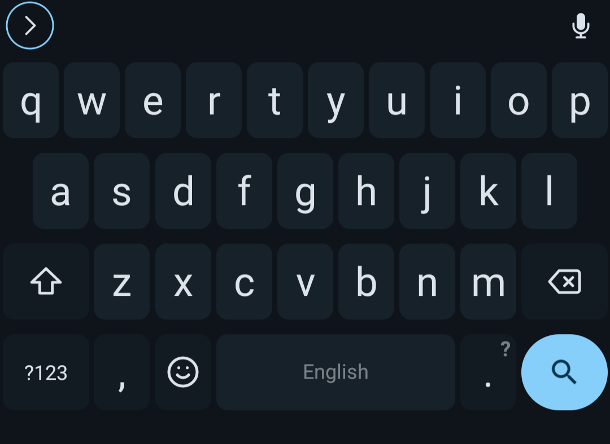

## Intro
A few days ago, someone on a Matrix server introduced me to the FUTO Keyboard. The new keyboard application seemed promising as a replacement for the AnySoftKeyboard application.

I went to its website to install it. Once I set it up, the keyboard looked neat. Although it is in alpha,[^1] I love this keyboard.

## Why replace AnySoftKeyboard?
I am multilingual, so I have installed many language packs for AnySoftKeyboard. I did not want too many of these language packs unnecessarily installed because they take up launcher space.

## In what way does the FUTO Keyboard look neat?
It looked like a vanilla Android keyboard. But, the top-left corner of the FUTO keyboard has a button with a right-pointing arrow enclosed in a glowing circle. The number and symbol keys' layouts are similar to those of the Gboard and the AOSP keyboard.

## What is the use of the FUTO Keyboard's button?
The FUTO Keyboard's button can be used to select emojis, control the cursor during text-editing mode, switch between languages, undo, redo, copy and paste, access its settings, switch its theme, show debug info, and access clipboard history. The long list shows the versatility of the button on the keyboard.

The add-ons may eventually add even more functionality to the button.

## Add-ons?
Add-ons exist---however, the number of add-ons fit on the palm; therefore, add-ons are not to be seen other than voice input and dictionaries.[^2] [^3]

I also hope the FUTO add-on authors could publish them with various input engine support as they will benefit the mobile users who type logographic scripts. 

## What tricks did you learn on the FUTO Keyboard?
I learned how to switch multiple languages on the FUTO Keyboard by holding the spacebar until the switch keyboard languages dialog pops up. This neat trick helped me switch between many languages like a shortcut.

I also learned that gesture swiping existed. I have not extensively tested this feature, but gesture swiping seemed interesting.

## Is it finally a solution for Chinese and Japanese languages?
Unfortunately, I have not found the keyboard inputs for Chinese and Japanese. The Fcitx keyboard is a solution for Chinese and Japanese. It is not as fancy as the FUTO keyboard, but the Fcitx keyboard is sufficient for now.

Eventually, the add-ons using a different input engine will solve this problem.

## Where can I try the FUTO Keyboard?
The FUTO Keyboard's official website is located in the footnote. The website points to the source code, chats, add-ons, and the FUTO Voice Input.[^1]

## FUTO Voice Input?
Yes, the FUTO Voice Input application also exists;[^4] however, I have not tried it yet. I have not used voice assistants much for various reasons. When I do, I will write an article about it.

## Conclusion
It is great for an alpha keyboard app. The add-ons feature takes the FUTO Keyboard to the future. When this keyboard matures, I will use it as a daily driver.

## Footnotes
[^1]: https://keyboard.futo.org/#download
[^2]: https://keyboard.futo.org/voice-input-models
[^3]: https://keyboard.futo.org/dictionaries
[^4]: https://voiceinput.futo.org/
